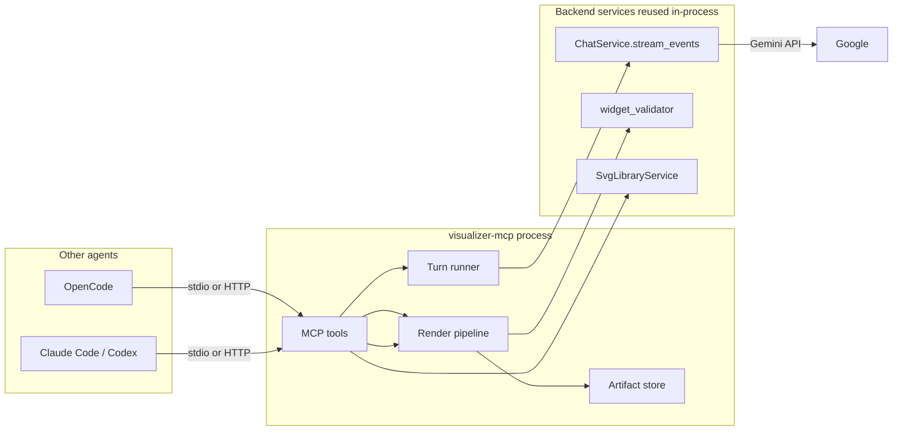

# MCP Access Server - Design and Implementation Plan

Status: implemented (Phase 1 + core of Phase 2). User-facing docs: [MCP-SERVER.md](MCP-SERVER.md).
Grounding: based on inspection of `apps/backend/app/main.py`, `app/services/chat_service.py`, `app/agent/widget_validator.py`, `app/agent/svg_library.py`, `app/agent/svg_preview_renderer.py`, `app/repositories/conversations.py`, `apps/frontend/src/lib/designTokens.ts`, `lib/widgetBridge.ts`, `lib/svgExport.ts`, `components/WidgetFrame.tsx`, `docs/SSE-STREAM-PROTOCOL.md`, and `docs/current/agent-runtime-reference.md`.

## 1. Goal

Expose the visualizer-agent and its outputs over MCP so other agents (coding agents such as OpenCode, Claude Code, Codex) can:

1. Ask for an illustration or an interactive visual on any topic ("draw me how MoE routing works", "make an interactive slider for gradient descent").
2. Receive validated artifacts as ordinary files: `.svg`, `.png`, `.html`, ready to embed in a README, docs folder, or open in a browser.
3. Render and preview those artifacts **outside** the React web app, with no dependency on the frontend.
4. Continue a conversation (`conversation_id` round-trip), and optionally re-render or validate visual code they already have.

The web app keeps working unchanged. The MCP server is an additional client of the same backend services, not a replacement path.

## 2. What gets exposed

### 2.1 Tools (Phase 1)

| Tool | Purpose | Model call |
|------|---------|-----------|
| `visualize` | Generate a visual from a prompt via the agent; returns the widget plus rendered files | yes |
| `render_visual` | Validate + render existing `widget_code` (SVG/HTML) into files, no agent call | no |
| `validate_visual` | Report contract violations for hand-authored SVG/HTML before rendering | no |
| `get_capabilities` | List agent ids (`visualizer`, `svg`), models, renderers available on this machine | no |

Proposed signatures (Pydantic-style, FastMCP will derive the JSON schema):

```python
class VisualizeArgs(BaseModel):
    prompt: str                              # what to visualize
    agent_id: str = "visualizer"             # "visualizer" | "svg" (template agent)
    model: str | None = None                 # Gemini model override
    subject: str | None = None
    conversation_id: str | None = None       # pass back for follow-ups
    theme: Literal["light", "dark"] = "light"
    formats: list[Literal["svg", "png", "html"]] = ["svg", "png"]
    scale: float = 2.0                       # PNG only, 680 * scale px wide
    output_dir: str | None = None            # default artifact root (see 2.4)
    include_code: bool = True                # inline widget_code in the result
    inline_image: bool = True                # PNG also returned as MCP image content
    timeout_s: float = 240.0

class RenderedFile(BaseModel):
    format: Literal["svg", "png", "html"]
    path: str                                # absolute path on the MCP server host
    bytes: int
    width: int | None = None
    height: int | None = None
    theme: Literal["light", "dark"] | None = None
    renderer: str | None = None              # "playwright" | "magick" | "inkscape" | "rsvg-convert"

class VisualTurn(BaseModel):                 # result of visualize
    status: Literal["ok", "no_visual", "error"]
    conversation_id: str
    title: str | None
    kind: Literal["svg", "html"] | None
    assistant_text: str
    follow_up_chips: list[str] = []
    widget_code: str | None
    files: list[RenderedFile] = []
    warnings: list[str] = []                 # e.g. "png renderer unavailable", "recovery pass used"
```

Behavior notes:

- `visualize` maps `stream_chat` events to MCP progress notifications (`status` events and delta activity), so long generations show liveness in clients that render progress.
- If the agent answers without producing a widget, return `status="no_visual"` with `assistant_text` (not a hard error). Hard errors (rate limit, model failure, timeout) surface as tool errors with actionable text.
- `formats` degrade softly: if a PNG renderer is unavailable, the file entry is omitted and a warning is added; SVG/HTML files are always written.
- Overwrite is idempotent: same `title` + `theme` + `format` replaces the previous file; the manifest is rewritten.

### 2.2 Tools (Phase 2, only after Phase 1 is in real use)

| Tool | Notes |
|------|-------|
| `list_svg_templates` | Wraps `SvgLibraryService.list_templates()`, with optional query filter |
| `get_svg_template` | Returns template source SVG + metadata for the `svg` agent workflow |
| `list_conversations` | Thin read of the SQLite repository |
| `get_conversation` | Reconstruct past widget payloads from `message_history_json` tool-call parts (verify shape first, see Risks) |

### 2.3 MCP resources and prompts (Phase 3, optional)

- Resources: generated artifacts as `artifact://{conversation}/{title}/{file}` and the widget theme CSS as `theme://css`.
- Prompts: `visual-design-contract` compiled from `skills/visualizer/SKILL.md` + `design-system.md`, so external agents can author contract-compliant SVG themselves and verify with `validate_visual`.

### 2.4 Artifacts on disk

```
<root>/<conversation_id>/<widget_title>/
  manifest.json
  <widget_title>.light.svg
  <widget_title>.light.png
  <widget_title>.light.html
```

- Default root: `~/.visualizer-agent/artifacts` (portable, outside the repo). Override per call with `output_dir`, or globally with `VISUALIZER_MCP_ARTIFACT_DIR`.
- `manifest.json` carries provenance: title, kind, conversation_id, agent_id, model, prompt, theme, scale, created_at, files, warnings, validation status.
- All paths returned in results are absolute.
- Note for docs: opening generated HTML executes its CDN scripts; artifacts are as trusted as the model that produced them. Keep the artifact root out of anything sensitive.

## 3. Architecture



Two process shapes, one codebase:

1. **Standalone process** (recommended, Phase 1): `visualizer-mcp --transport stdio` spawns, imports backend modules directly (`app.services`, `app.agent`, `app.core`), instantiates `ChatService(settings)`, and never needs uvicorn or the FastAPI app. This is the shape coding agents use locally.
2. **HTTP transport** (Phase 3): same binary with `--transport http --host 127.0.0.1 --port 8765` (FastMCP streamable-http) for remote or multi-client use, bearer-auth with `CHAT_API_KEY`. Mounting into the existing FastAPI app (`/mcp`) is possible later but not chosen first: it adds lifespan/session-manager wiring and couples MCP availability to backend restarts.

Module map (new files):

```
apps/backend/app/mcp/
  __init__.py
  server.py          # FastMCP instance, tool registration, transport entrypoint
  __main__.py        # python -m app.mcp / visualizer-mcp console script
  tools.py           # tool functions (plain async functions, MCP-free, unit-testable)
  turn.py            # run_visual_turn(): stream events -> VisualTurn + progress callback
  artifacts.py       # artifact root resolution, layout, manifest read/write
  render/
    __init__.py
    pipeline.py      # format orchestration: svg_export -> flatten -> png; html doc
    theme.py         # loads generated widget-theme.json/css; token + ramp tables
    svg_export.py    # Python port of buildExportableSvg (namespace, theme class, style tag)
    svg_flatten.py   # class/var() -> literal presentation attributes (rasterizer-safe)
    html_document.py # srcdoc-equivalent assembly + standalone bridge shim
    png.py           # renderer chain: playwright -> flatten + magick/inkscape/rsvg-convert
assets (generated):
  apps/backend/app/mcp/render/assets/widget-theme.css
  apps/backend/app/mcp/render/assets/widget-theme.json
frontend:
  apps/frontend/scripts/export-theme.ts   # bun script: TS theme -> generated assets
tests:
  apps/backend/tests/test_mcp_*.py
```

`pyproject.toml` additions:

```toml
[project.optional-dependencies]
mcp = ["mcp>=1.12,<2.0.0"]
render = ["playwright>=1.49"]

[project.scripts]
visualizer-mcp = "app.mcp.__main__:main"
```

## 4. The core problem: rendering outside the web app

Widgets are fragments. Meaning exists only when they are assembled with the theme stylesheet and bridge script that today live in the frontend TypeScript:

- `apps/frontend/src/lib/designTokens.ts` -> `buildWidgetThemeCss()`
- `apps/frontend/src/lib/widgetBridge.ts` -> `buildBridgeScript(title)`
- `apps/frontend/src/lib/svgExport.ts` -> `buildExportableSvg(code, theme)`
- `apps/frontend/src/components/WidgetFrame.tsx` -> srcdoc order: `<html class="{theme}">` -> tokens style -> bridge -> `widget_code`

The MCP render pipeline must reproduce this assembly in Python without hand-maintaining a second copy of the design system.

### 4.1 Theme contract: one source of truth

Decision (recommended): **TypeScript stays canonical.** A bun export script generates two artifacts consumed by Python:

- `widget-theme.css` - byte-identical string from `buildWidgetThemeCss()`, inlined into exported SVG files and standalone HTML.
- `widget-theme.json` - structured tokens: light/dark token maps, the nine color ramps with per-mode fill/stroke/title/subtitle values, utility class rules. Used by the flattener, never parsed back out of CSS.

Freshness is enforced structurally: `scripts/check.ps1` / `check.sh` regenerate and fail on `git diff --exit-code` for the generated files, and a pytest port of the frontend contract test asserts the same surfaces (tokens, ramps, utilities) exist in the generated CSS. The existing bun tests remain the primary guard on the TS side.

Rejected alternatives:

- Port the whole builder to Python and make it canonical: inverts ownership, risks silent frontend drift, more churn.
- No generated file, MCP calls a Node helper at runtime: adds a Node process dependency to a Python tool for no ongoing benefit.

### 4.2 SVG files (always available)

Python port of `buildExportableSvg`, same output contract:

1. Reject anything not starting with `<svg`.
2. Insert `<style>{widget-theme.css}</style>` as the first child.
3. Set `class="{theme}"` on the root (append, not replace).
4. Ensure `xmlns`, prepend `<?xml version="1.0" encoding="UTF-8"?>`.

This restores exact colors in browsers because CSS variables resolve against the inlined stylesheet; the theme class pins light/dark.

### 4.3 PNG files

Renderer chain, best available first:

1. **Playwright (Chromium)**, if installed: load the assembled standalone document (SVG embedded, or the HTML document for HTML widgets), wait for `document.fonts.ready` plus a short settle delay, screenshot full-page at `680 * scale` logical px (device scale factor handles crispness). Works uniformly for SVG and HTML, and is the only honest path for HTML widgets.
2. **Flat SVG + external rasterizer** (SVG only): `svg_flatten.py` rewrites classes and `var(--*)` references into literal presentation attributes using `widget-theme.json` (ramps are inheritance-based: `.c-purple .box` etc., resolved with ancestor context). Then reuse the existing external rasterizer pattern from `app/agent/svg_preview_renderer.py` (`magick` | `inkscape` | `rsvg-convert`). Rationale: librsvg/ImageMagick/Inkscape have weak or absent CSS custom property support; flattening makes the raster path deterministic. If any `var(` remains unresolved, skip this path and report an actionable warning instead of rendering wrong colors.
3. Neither available: omit `png` from files, add a warning naming both remedies (`pip install 'visualizer-agent-backend[render]'` + `playwright install chromium`, or install ImageMagick/Inkscape).

Fonts: rasterization falls back to system fonts when Plus Jakarta Sans / JetBrains Mono are absent. Acceptable for v1; bundling the font files for Playwright rendering is a polish item.

### 4.4 HTML files (standalone, interactive)

Emit a complete document mirroring the srcdoc order:

```
<!doctype html><html class="{theme}"><head><meta viewport>
  <style id="design-tokens">{widget-theme.css}</style>
  <script>standalone bridge</script>          <- new, small, fixed
</head><body>{widget_code}</body></html>
```

Standalone bridge differences from `widgetBridge.ts`: `sendPrompt` becomes a `CustomEvent('visualizer:prompt')` dispatch plus console log (there is no host chat), `openLink` calls `window.open(url, '_noopener')`, resize notifications are dropped, and `postMessage` theme handling stays harmless. Interactivity (sliders, step-through logic, CDN libs from the allowlisted hosts) is preserved. Notes:

- `file://` pages can load allowlisted CDN modules (esm.sh, jsdelivr, unpkg serve `Access-Control-Allow-Origin: *`), so most interactive widgets work by double-clicking the file. A few CDN/library combinations misbehave on `file://` (local module imports, some workers); Phase 3 adds an artifact HTTP route or a `--serve-artifacts` static server for a `preview_url` if this proves annoying in practice.
- Inline image content: when a PNG exists and `inline_image=True`, include it in the MCP result as an `ImageContent` block so hosts that render tool-result images show the visual inline in the coding agent's conversation.

## 5. Small refactor: consume events without parsing our own SSE

`ChatService.stream_chat()` currently yields SSE-encoded strings (`encode_sse(StreamEvent(...))`). Instead of the MCP server parsing its own wire format, split it:

- `ChatService.stream_events(request, *, client_id)` - async generator of `StreamEvent` (move the existing body, mechanically).
- `ChatService.stream_chat(...)` - thin wrapper yielding `encode_sse(event)`; behavior and existing tests unchanged.

The MCP turn runner then consumes typed events directly, maps `widget_ready` / `assistant_done` / `error` into `VisualTurn`, and forwards status/progress. `run_visual_turn` gets a fake-generator unit test, so no Gemini call is needed to test the MCP path.

Known caveats to encode in the runner:

- All visual recovery, validation, repair, and rate limiting happen inside `ChatService`; the MCP path inherits them for free.
- `stream_events` catches failures and emits an `error` event rather than raising; the runner must convert terminal `error` events into tool errors.
- On client timeout, cancel the generator; the turn may not be persisted. Document, do not attempt to "fix" mid-stream persistence.

## 6. Delivery plan

Phases are independently verifiable; each ends in a state a reviewer can run.

### Phase 1 - stdio server with visualize + files (the useful core)

1. Refactor `chat_service` (`stream_events` split). Verify: existing pytest suite green, no diff in SSE output for a mocked run.
2. Frontend theme export script + generated assets + pytest contract port + check-script freshness gate. Verify: `bun run export:theme` idempotent; `scripts/check` catches a hand-edited generated file.
3. `artifacts.py` + `render/svg_export.py` (port) + golden tests against real widget SVGs. Verify: exported SVG renders correctly opened directly in a browser, colors match the web app for both themes.
4. `turn.py` + tests with a fake event stream, including recovery-warning and no-visual paths.
5. `tools.py` + `server.py` + `__main__.py` (`visualizer-mcp --transport stdio`), `get_capabilities`, `validate_visual`, `render_visual` (files only; PNG lands in Phase 2), `visualize`.
6. Docs (`docs/MCP-SERVER.md`) + repo client config examples.

Verification for the phase (prove it works, do not assume): spawn the server through an MCP client session (in-process stdio client test), call `visualize` for a real prompt, confirm `widget_ready`-derived files exist, open the SVG and confirm visual correctness by eye, run a follow-up turn with the returned `conversation_id`.

### Phase 2 - full render parity

7. `svg_flatten.py` + `png.py` chain + golden tests; `[render]` extra; `inline_image`.
8. `html_document.py` + standalone bridge; HTML widget end-to-end (generate an interactive widget, open standalone file, exercise a control).
9. `render_visual` + `validate_visual` polish; `list_svg_templates` / `get_svg_template` wrapping `SvgLibraryService.list_templates()`.

### Phase 3 - remote and system interaction

10. HTTP transport + bearer auth (`CHAT_API_KEY`), Tailscale/remote guidance, nginx note if proxied.
11. Artifact serving (`preview_url`) and/or `--serve-artifacts`.
12. Conversation tools (`list_conversations`, `get_conversation`) after verifying widget reconstruction from `message_history_json` is actually possible; async job tools (`start_visual` / `check_visual`) only if real clients hit tool timeouts.
13. MCP resources + `visual-design-contract` prompt.

## 7. Client configuration (examples to ship in docs)

OpenCode (`opencode.json`, matches the existing repo file structure):

```json
{
  "mcp": {
    "visualizer": {
      "type": "local",
      "command": ["C:\\projects\\visualizer-agent\\apps\\backend\\.venv\\Scripts\\python.exe", "-m", "app.mcp", "--transport", "stdio"],
      "enabled": true
    }
  }
}
```

Claude Code: `claude mcp add visualizer -- <venv python> -m app.mcp --transport stdio` (run with the backend venv).
Codex and other MCP clients: equivalent stdio command entry; remote clients use the Phase 3 HTTP URL with an `Authorization: Bearer <CHAT_API_KEY>` header.

Env: `GOOGLE_API_KEY` (required, same as backend), `VISUALIZER_MCP_ARTIFACT_DIR` (optional), `CHAT_API_KEY` (HTTP transport auth).

## 8. Decisions and tradeoffs

| Decision | Chosen | Alternative | Why |
|----------|--------|-------------|-----|
| Where MCP lives | Standalone process importing backend modules | Mount into FastAPI; or HTTP proxy to running backend | No uvicorn/lifespan coupling, no double config; proxy adds a hop for no gain locally |
| Transport | stdio first, HTTP later | HTTP only | Zero setup for local coding agents; HTTP adds auth surface before it is needed |
| Theme source of truth | TS canonical, generated CSS/JSON for Python, drift gate | Port builder to Python; runtime Node helper | Keeps the tested frontend contract authoritative without a runtime Node dependency |
| PNG for SVG | Flatten + external rasterizer (fallback), Playwright (preferred) | Raw rasterizer on themed SVG | Rasterizers lack CSS var support; flattening is deterministic against the closed class contract |
| PNG for HTML | Playwright only | None | Screenshot is the only faithful option; soft-degrade keeps it optional |
| Widgets from history | Phase 3, verify first | Build now | Depends on PydanticAI history serialization shape; not needed for the core loop |
| Async generation API | Deferred to Phase 3, only if needed | Build now | Blocking + progress works in common clients; do not add two-phase state without a real timeout problem |

## 9. Risks and open questions

- **Rasterizer CSS support** is the main quality risk for PNG. Mitigated by flattening plus the Playwright path; validate against the real widget corpus (`data/SVGs_Organized/`, offline demo HTML exports) before trusting goldens.
- **Client tool timeouts**: generation can exceed 60-120s (recovery passes). Progress notifications plus `timeout_s` help; if a specific client still kills calls, Phase 3 async tools are the answer. Confirm actual behavior in OpenCode and Claude Code during Phase 1 verification.
- **Separate process sharing state**: the MCP process opens the same SQLite file as a running backend. Current repository code does not enable WAL mode; concurrent writes are possible in theory. Recommend enabling WAL in `_connect` (or documenting "do not run both under load") as a small pre-Phase-1 fix. Rate limiting is per-process, so a separate MCP process doubles the effective Gemini budget; acceptable locally, note it in docs.
- **Config/prompt staleness**: `ChatService` compiles prompts at construction; editing `config/` requires restarting the MCP process too (existing backend caveat, now duplicated).
- **Windows renderer availability**: `rsvg-convert` is rare on Windows; ImageMagick or Inkscape usually present; Playwright is the cross-platform recommendation.
- **History-based widget recovery** (`get_conversation`): verify that `show_widget` tool-call arguments survive `ModelMessagesTypeAdapter` serialization before promising this tool.
- **Tool result size**: `widget_code` up to 75k chars. `include_code` is a parameter; large outputs are the caller's choice.

## 10. Non-goals

- No new image-generation models; visuals remain agent-authored SVG/HTML.
- No shell/filesystem/code-execution tools exposed to the visualizer model itself.
- No changes to the widget contract, validator rules, or design tokens.
- No public exposure by default: stdio is local-only, HTTP binds `127.0.0.1` and requires `CHAT_API_KEY`.
